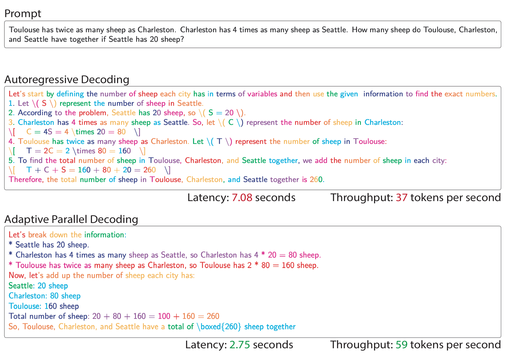

# Adaptive Parallel Decoding (APD)

**Official repository for the paper:** [Accelerating Diffusion LLMs via Adaptive Parallel Decoding](https://arxiv.org/abs/2506.00413)

*Daniel Israel, Guy Van den Broeck, Aditya Grover*

**NeurIPS 2025 (Spotlight)**

## Abstract

The generation speed of LLMs are bottlenecked by autoregressive decoding, where tokens are predicted sequentially one by one. Alternatively, diffusion large language models (dLLMs) theoretically allow for parallel token generation, but in practice struggle to achieve the speed of autoregressive models without significantly sacrificing quality. We therefore introduce adaptive parallel decoding (APD), a novel method that dynamically adjusts the number of tokens sampled in parallel. We achieve this by defining a multiplicative mixture between the dLLM marginal probabilities and the joint probability of sequences under a small auxiliary autoregressive model. This inverts the standard setup of speculative decoding, where the goal is to sample from a large autoregressive verifier by drafting from a smaller model. We further optimize APD by enabling KV caching and limiting the size of the masked input. Altogether, our method puts forward three tunable parameters to flexibly tradeoff throughput and quality. We show that APD provides markedly higher throughput with minimal quality degradations on downstream benchmarks.



## Quick Start

### Demo

The fastest way to see APD in action is to run our interactive demo:

```bash
# Clone the repository
git clone https://github.com/danielmisrael/apd.git
cd apd

# Create and activate conda environment
conda create -n apd python=3.10
conda activate apd

# Install dependencies
pip install -r requirements.txt

# Run the demo with default settings
python demo.py
```

The demo will show real-time colored generation where different colors represent tokens generated in parallel batches, demonstrating APD's adaptive parallel decoding capabilities.

### Demo Options

Customize the demo with various parameters:

```bash
# Custom prompt
python demo.py --prompt "Write a short story"

# Adjust APD parameters for speed/quality tradeoff
python demo.py --apd_mixture_weight 0.5 --kv_window 8 --max_lookahead 200

```

**APD Parameters:**
- `--apd_mixture_weight` (R): Controls the mixture between dLLM and verifier probabilities (0.0-1.0, higher = faster)
- `--kv_window` (W): KV cache window size (>0, lower = faster)  
- `--max_lookahead` (M): Maximum parallel lookahead tokens (>0, lower = faster)

## Repository Structure

```
apd/
├── demo.py              # Interactive demonstration script
├── eval.py              # Evaluation script for benchmarks
├── harness.py           # Evaluation harness utilities
├── dream/               # Dream model implementation
├── llada/               # LLADA baseline implementation
├── scripts/             # Reproduction scripts for paper figures/tables
├── eval_config/         # Evaluation configurations
├── figures/             # Paper figures and plots
├── results/             # Experimental results
└── requirements.txt     # Python dependencies
```

## Reproducing Paper Results

Use the scripts in the `scripts/` folder to reproduce the figures and tables from the paper:

```bash
# Make scripts executable
chmod +x scripts/*.sh

# Reproduce Figure 2 (K variation plots)
./scripts/fig2.sh

# Reproduce Figure 3 (R parameter analysis)
./scripts/fig3.sh

# Reproduce Figure 4 (M parameter analysis) 
./scripts/fig4.sh

# Reproduce Figure 5 (W parameter analysis)
./scripts/fig5.sh

# Reproduce Figure 6 (Pareto frontier)
./scripts/fig6.sh

# Reproduce Table 1 (baseline comparisons)
./scripts/tab1.sh
```

## Evaluation

Examples of custom evaluations on benchmarks:

```bash
# GSM8K evaluation with APD and R=0.7
python eval.py --model_alias dream --task gsm8k --alg apd --apd_mixture_weight 0.7

# GPQA evaluation with APD and W=16, M=100
python eval.py --model_alias dream --task gpqa --alg apd --kv_window 16 --max_lookahead 100

# Math evaluation with baseline method
python eval.py --model_alias llada --task math --alg random
```

## Citation

If you use this code in your research, please cite our paper:

```bibtex
@article{israel2025accelerating,
  title={Accelerating Diffusion LLMs via Adaptive Parallel Decoding},
  author={Israel, Daniel and Broeck, Guy Van den and Grover, Aditya},
  journal={arXiv preprint arXiv:2506.00413},
  year={2025}
}
```
